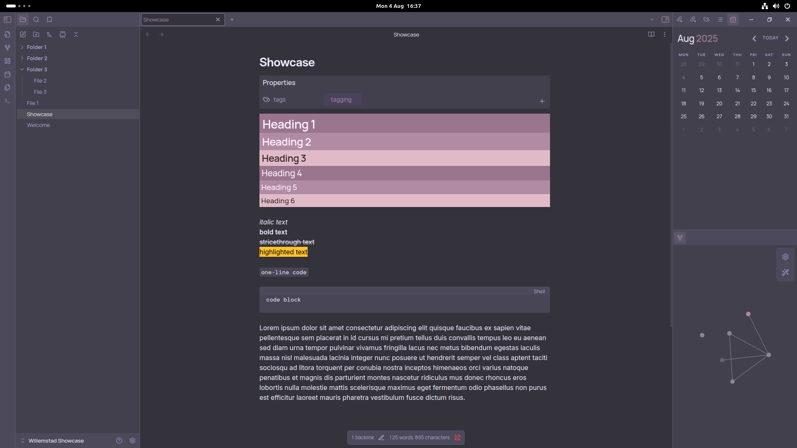
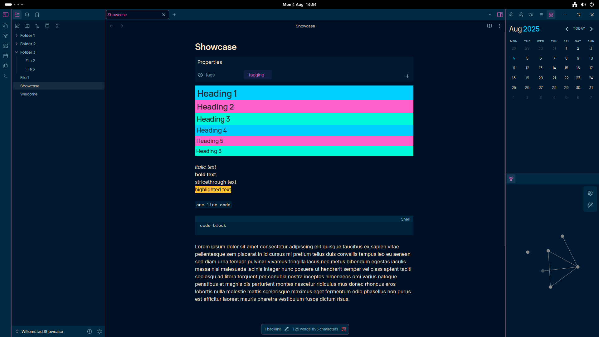
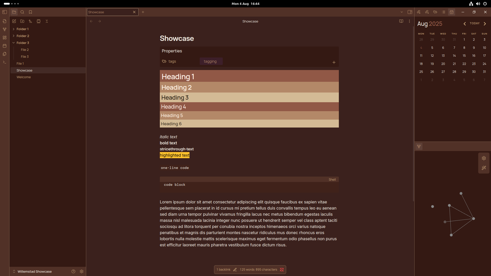
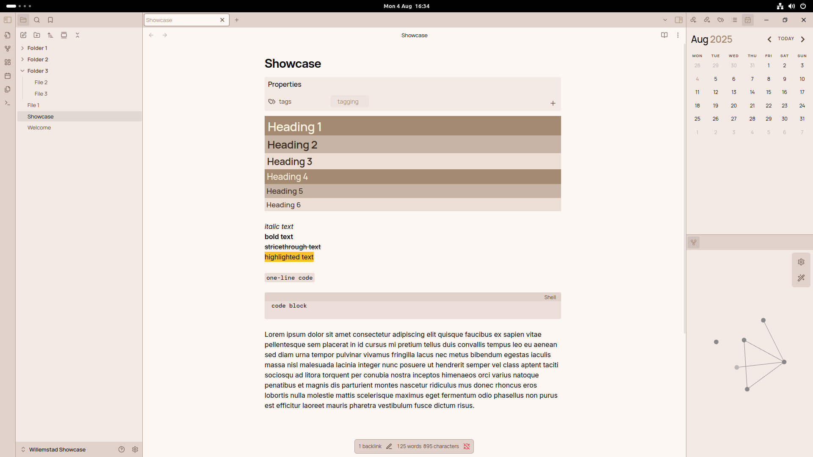
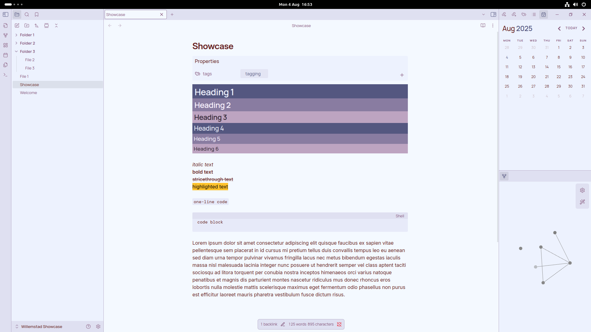

# About 
I've recently discoered the [Willemstad](https://github.com/tingmelvin/willemstad-x) theme for Obsidian and fell in love with it. There's incredible amount of color-scheme ideas for the theme, and here are some of my favourites: 

# Dark Themes

**Dark Plum**
- color-bade: 
	- Ultra-Low Contrast (Nord)
	- Viola
- color-accent:
	- Morgenstern (Dusk)

**Fun in the Dark** 
- color-base: 
	- Vivid
	- Blistering Barnacles, We're in Syldavia
- color-accent:
	- Aftershock for Dark (changes colour order) 

**Library**
- color-base: 
	- Catppuccin (Aggressive contrast with step 10 dip)
	- Nocturnal Study
- color-accent: 
	- Liiv

# Light Themes 

**Beige Dream** 
- color-base: 
	- Low Contrast
	- Pearl Mist
- color accent:
	- Cream 

**Pastel Perfect - Purple** 
- color-base: 
	- Glow
	- Arcade Glow
- color-accent:
	- Vine 